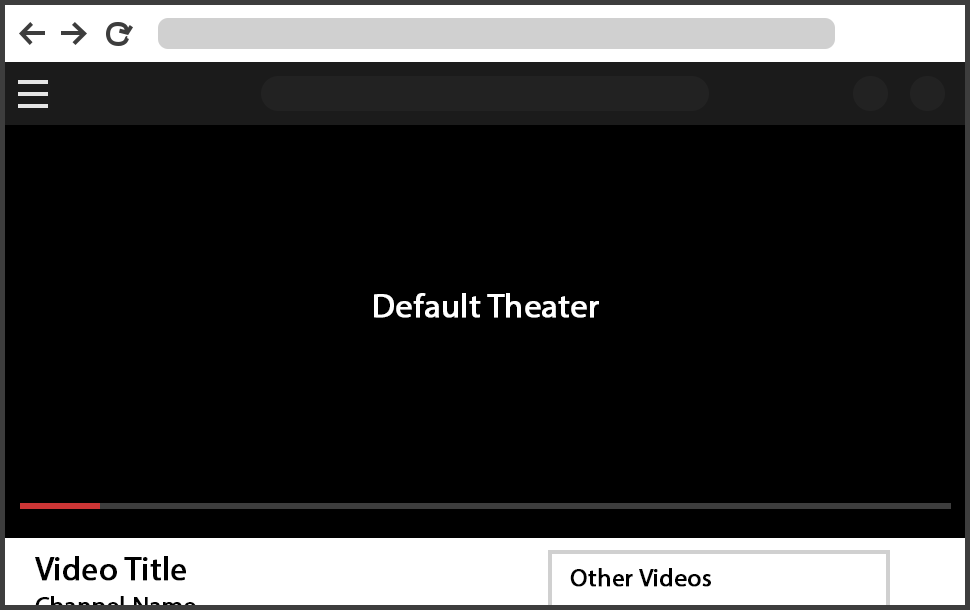

# Full YouTube Theater

A FireFox add-on to make the video player as large as the window size when in theater mode. The mastbar is visible when you hover over the area at the top of the screen. 

   

Full YouTube Theater with mouse hover:

